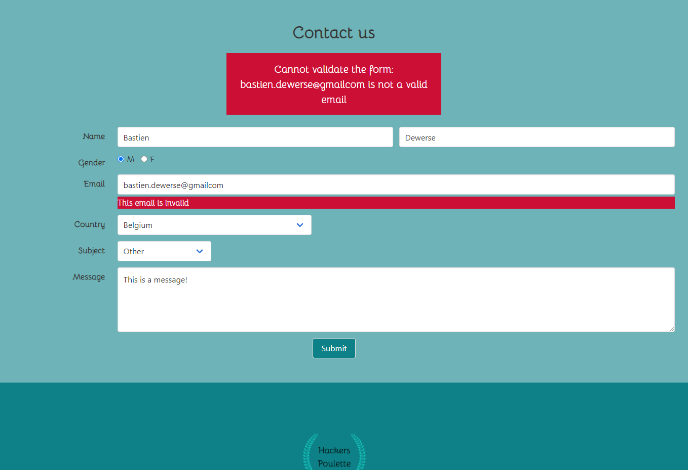

# hackers-poulette

<!-- PROJECT LOGO -->
 

    

<!-- TABLE OF CONTENTS -->
## Table of Contents

* [About the Project](#about-the-project)
  * [The Mission](#the-mission)
  * [Instructions](#instructions)
  * [Built With](#built-with)
* [Usage](#usage)
* [Contact](#contact)
* [Acknowledgements](#acknowledgements)

<!-- ABOUT THE PROJECT -->
## About The Project

The project is a form gathering, sanitizing, validating then sending via mail informations to contact the support of a company. 
Challenge made in 4 days by Bastien Dewerse at [BeCode](https://becode.org/) 
Deadline: 28/08/2020

### The mission

The company _Hackers Poulette ™_ sells Raspberry Pi accessory kits to build
your own. They want to allow their users to contact their support team. Your
mission is to create a fully-functioning online "contact support" form, in *PHP*. It must *display a contact form* and *process the received answer* (sanitize, validate, answer the user).

The form should be comprised of:

- name and lastname
- gender
- email address
- country
- subject (3 possibilities)
- message

NOTE: All field, except _subject_, have to be completed. The field _subject_
takes a default value of *Other*.

### Instructions

Must have:

- the project repository must include a low-fidelity mock-up
- the form's html code *must* be semantically valid
- the HTML *must be* accessible to blind people
- in case of wrong input, the form should display a useful visual clue about the error
- display the error message near the correct input field
- the error message must be readable (helpful to users)
- the form has to be *sanitised* and *validated* (server side)
- if all required inputs are valid, the script should respond by email to a given address
- implement a [honeypot](https://www.thryv.com/blog/honeypot-technique/) anti spam technique.

Optional:

- client side validation with *JavaScript*
- work on a good and clear _user experience_ (UX)
- respond to the user request with [Ajax](https://www.javatpoint.com/ajax-tutorial)

### Built With

* [Bulma](https://https://bulma.io/)
* [PHPMailer](https://github.com/PHPMailer/PHPMailer)

<!-- GETTING STARTED -->

<!-- USAGE EXAMPLES -->
## Usage

Go to [https://hackers-poulette-form-project.herokuapp.com/](https://hackers-poulette-form-project.herokuapp.com/)
And fill the fiels of the form.
An email will be sent to the mail address you inputed and a gmail address used as the support.

Fields are sanitized and validated before being sent as mail.
 

<!-- ROADMAP -->

<!-- CONTRIBUTING -->

<!-- LICENSE -->

<!-- CONTACT -->
## Contact

Bastien Dewerse - bastien.dewerse@example.com

Project Link: [https://github.com/DewerseB/hackers-poulette](https://github.com/DewerseB/hackers-poulette)

<!-- ACKNOWLEDGEMENTS -->
## Acknowledgements
